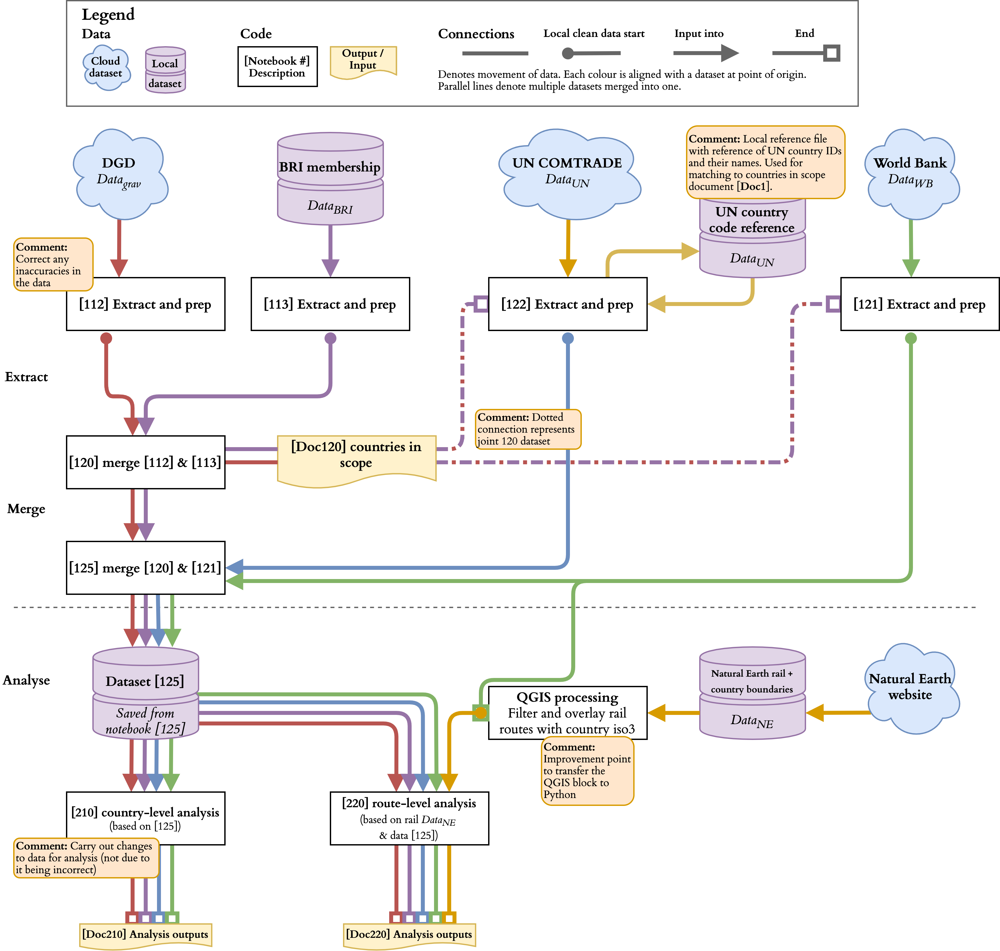

# UCL_Dissertation
Yidai Yilu project.

**Towards a systems-based understanding of international trade
The role of infrastructure and distance in the case of the Belt and Road Initiative**
_This dissertation is submitted in part requirement for the MSc Spatial Data Science and Visualisation in the Centre for Advanced Spatial Analysis, Bartlett Faculty of the Build Environment, UCL._

### Abstract
This paper address calls in literature to incorporate transport literature into studies of international trade and extends this by advocating for a systems-based solution. The study focuses on the effects of different measures in international trade literature on the collection of trading entities as a whole and specifically in identifying most efficient paths across which goods could be transported. To achieve this, a proof of concept network is created based on the Belt and Road Initiative at country and route level and outcomes compared.
Findings suggests that route-level analysis could potentially lead to more accurate estimations of countries along routes as well as the distance travelled.
Finally, as a stepping stone towards a means of examining international trade from a systems point of view, the framework and data processing flows are proposed as a baseline on which future complementary work can expand based on the published material on GitHub.

### Repository description
This repository holds all code, data extractors, data downloads and analysis outputs part of this project. The figure below maps out the various interconnecitions.

